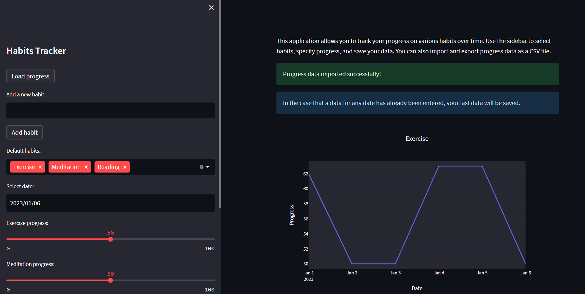

# Daily Habits Tracking Application with Streamlit and ChatGPT

This is a daily habits tracking application that helps users track their progress and stay motivated. It was built using [Streamlit](https://www.streamlit.io/) and [ChatGPT](https://openai.com/blog/chatgpt/).

## Features

- Select default habits from a list or add new habits
- Remove habits from the list
- Track progress for each habit using a slider
- See visualizations of progress for each habit
- See analysis of progress over time
- Save and load progress data

## Technologies Used

- [Python](https://www.python.org/)
- [Streamlit](https://www.streamlit.io/)
- [Pandas](https://pandas.pydata.org/)
- [ChatGPT](https://openai.com/blog/chatgpt/)

## Running the App

1. This part will be updated.

## Contributing

Contributions to this project are welcomed! If you have an idea for a new feature or have found a bug, please open an issue or submit a pull request.

## License

This project is licensed under the [MIT License](LICENSE).

## Acknowledgements

I would like to thank ChatGPT for providing guidance and clarification
